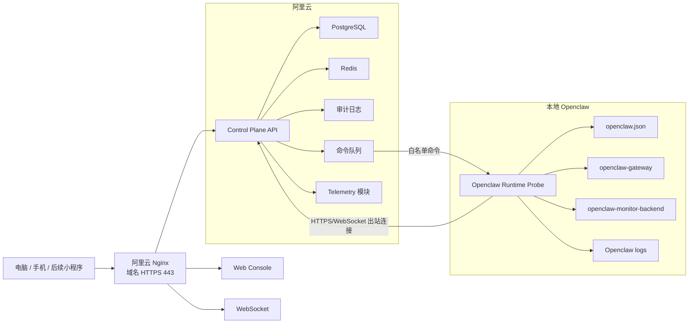

# OC-Monitor 端到端分析与优化方案

更新时间：2026-05-06

## 结论

OC-Monitor v3 不是完全失败，它已经把阿里云侧的基础监控跑起来了：FastAPI、PostgreSQL、Redis、Nginx HTTPS、systemd 服务和 collector 都在线。但它和最初的目标仍有明显偏差：当前系统主要是“服务器指标监控原型”，不是“Openclaw 管理与监控控制台”。

最关键的问题不只是代码缺功能，而是从设计、研发、测试到部署的链路没有形成闭环：设计目标被收窄，开发过程中产生大量补丁式实现，GitHub 仓库混入运行产物，部署版本和仓库版本漂移，最终报告用“100% 完成”覆盖了真实缺口。

建议路线：不要推倒重来；先接管和清理 v3，把它稳定为 Telemetry 底座，再新增 Openclaw Control Plane，专门处理 Agent、模型、任务、配置、审计和远程控制。

## 已核验事实

### GitHub

- 已使用本地 Openclaw 服务器上的 GitHub CLI 登录态访问 GitHub。
- 令牌只用于访问仓库，没有明文输出或写入文档。
- v3 仓库：`Samueljackson6/OC-Monitor-v3`
- 默认分支：`master`
- 远端 HEAD：`969cc87129b3b46dda04983f303885557c05f8fa`
- v2 仓库：`Samueljackson6/OC-WEBMonitor`
- v3 远端仓库存在严重污染：
  - `.api.pid`
  - `data/monitor.db`
  - `logs/api.log`
  - `logs/test.log`
  - `venv/`
  - `__pycache__/`
- v3 仓库缺少 `.gitignore`。
- v3 仓库未发现 GitHub Actions workflow。

### 本地开发目录

目录：`/home/samuel/.openclaw/workspace/dev_agent/oc-monitor-v3`

当前状态：

- `master` 分支指向远端最新提交。
- 工作区不干净：有修改、删除、未跟踪文件。
- `ui/node_modules/`、`ui/dist/`、日志、临时文件混在工作区。
- 多个“最终报告”与早期“设计 vs 实际对比”结论互相矛盾。

### 阿里云部署

主机：`47.98.184.188`

已运行：

- `oc-monitor-api.service`
- `oc-monitor-collector.service`
- `postgresql@16-main.service`
- `redis-server.service`
- `nginx.service`
- 旧版 `oc-webmonitor.service`

关键端口：

- `8000`：OC-Monitor v3 API
- `8443`：Nginx HTTPS
- `8500`：Nginx HTTP/跳转入口
- `8080`：旧 `oc_webmonitor`
- `8081`：本地 Openclaw Monitor 反向隧道
- `5432`：PostgreSQL，仅本机
- `6379`：Redis，仅本机

已验证：

- `GET /` 返回 `OC-Monitor 3.0.0`
- `GET /api/v1/metrics/health` 正常
- `GET /api/v1/config/stats` 正常
- `https://127.0.0.1:8443/health` 正常

存在问题：

- 多个 API 无需登录即可访问。
- 默认管理员账号可登录。
- `GET /api/v1/agents/list` 返回 500。
- API 代码模型字段与 PostgreSQL 表结构不一致。
- 清理任务仍操作 SQLite 文件，不清理真实 PostgreSQL 数据。
- HTTPS 证书为自签证书。
- systemd 实际安装文件与项目 `deploy/` 中的服务文件不一致。

### 本地 Openclaw

主机：`192.168.0.236`

已运行：

- `openclaw-gateway.service`
- `openclaw-monitor-backend.service`
- `openclaw-monitor-tunnel.service`
- `clawpanel.service`
- `nginx.service`

Openclaw 配置：

- 主配置：`/home/samuel/.openclaw/openclaw.json`
- 已确认顶层包含 `agents`、`models`、`tools`、`channels`、`commands`、`secrets`。
- `agents` 下包含 `defaults`、`list`。
- `models` 下包含 `mode`、`providers`。

这说明 Openclaw 管理控制台应该直接围绕 `openclaw.json` 和运行时服务建模，而不是只写一个泛化的 `agent_metrics` 表。

## 设计阶段分析

### 原始目标

最初目标包括：

- 本地 Openclaw 服务器监控。
- 阿里云服务器监控。
- Openclaw 系统运行状态。
- 任务执行统计。
- 所有 Agent 监控。
- 在页面修改 Agent 的模型与思考模式。
- 模型供应商与模型服务展示。
- 控制模型是否可用。
- 电脑、手机访问。
- 后续兼容微信小程序。

### v3 设计偏差

v3 设计把目标收窄成了“轻量监控系统”：

- 重点放在 CPU、内存、磁盘、Gateway 状态。
- Agent 被简化成 `agent_id/status/memory/cpu`。
- 没有把 Openclaw 的真实 Agent 配置、模型供应商、任务、审计建成核心领域模型。
- 没有定义配置变更的提交、应用、回执、回滚流程。
- 没有定义云端控制本地的安全边界。

### 设计优化

应拆成两个层：

1. Telemetry 底座
   - 服务器指标
   - 服务健康
   - 告警
   - 历史趋势

2. Openclaw Control Plane
   - Openclaw 实例
   - Agent 配置
   - 模型供应商
   - 模型启停
   - 任务统计
   - 命令队列
   - 审计与回滚

v3 已经可以承担第一层的一部分，但第二层基本还没开始。

## 开发阶段分析

### 主要问题

1. 仓库卫生失控
   - `venv/`、日志、数据库、pid 文件进入 GitHub。
   - 无 `.gitignore`。
   - 远端仓库包含 3000+ 文件，其中大量是虚拟环境依赖。

2. 工作区长期脏
   - 本地 `master` 上直接开发和补丁。
   - 修改、删除、未跟踪文件混在一起。
   - 无法明确哪些代码是已发布、哪些只是临时修复。

3. 测试与实际脱节
   - 报告宣称全部通过，但线上 `/api/v1/agents/list` 直接 500。
   - 没有把线上 smoke test 作为验收门槛。
   - 没有 CI workflow，测试不可持续。

4. 数据模型漂移
   - 代码期望 `agent_metrics.memory_mb`、`agent_metrics.cpu_percent`。
   - 真实 PostgreSQL 表里是 `memory`、`cpu`。
   - 没有数据库迁移工具，导致模型和数据库各走各的。

5. 安全实现停在演示层
   - 认证代码里有模拟用户库。
   - Secret 和账号配置硬编码/默认化。
   - 多个重要 API 没有鉴权保护。

6. 前端架构薄弱
   - 主要逻辑堆在 `App.tsx`。
   - 页面没有形成业务模块：Agent、模型、任务、审计都不完整。
   - 移动端和后续小程序兼容没有落到 API 契约。

### 开发流程优化

建议采用以下流程：

1. 需求冻结
   - 用 PRD 明确本期范围。
   - 所有功能都写验收条件。
   - “完成”必须绑定测试证据。

2. 架构设计
   - 单独维护架构文档。
   - 重大技术决策写 ADR。
   - 数据模型必须先评审。

3. 任务拆分
   - GitHub Issues + Milestones。
   - 每个任务必须有 owner、验收标准、测试方式。
   - 禁止用“项目总结”替代任务完成记录。

4. 分支策略
   - `main` 或 `master` 只保留稳定版本。
   - 功能开发走 `feature/*`。
   - 修复走 `fix/*`。
   - 发布走 `release/*`。

5. CI 质量门禁
   - Python lint/type/test。
   - 前端 lint/build。
   - API smoke test。
   - 安全扫描。
   - 禁止提交 `venv/`、`node_modules/`、日志、数据库、密钥。

6. Definition of Done
   - 代码已合并。
   - CI 通过。
   - 数据库迁移已提交。
   - 部署脚本更新。
   - 线上 smoke test 通过。
   - 文档只记录真实状态。

## 部署阶段分析

### 当前部署优点

- 阿里云上确实跑通了 API、PostgreSQL、Redis、Nginx。
- systemd 能托管 API 和 collector。
- HTTPS 入口可用。
- 本地 Openclaw 通过反向隧道已连到阿里云。

### 当前部署问题

1. 代码与部署漂移
   - `/opt/oc-monitor` 的代码和本地开发目录不完全一致。
   - `/etc/systemd/system` 的服务文件和仓库 `deploy/` 文件不一致。

2. 数据库无迁移
   - PostgreSQL 表结构无法追溯。
   - 线上已经出现字段不一致。

3. 清理任务错误
   - cron 执行 `/opt/oc-monitor/cleanup.py`。
   - 该脚本仍连接 SQLite `/opt/oc-monitor/data/monitor.db`。
   - 实际线上数据在 PostgreSQL，清理任务没有清到主库。

4. 安全边界不清
   - API 监听 `0.0.0.0:8000`。
   - Nginx 也暴露 `8443`。
   - 多个接口未认证。
   - 仍有默认账号。

5. 证书和域名未完成
   - 当前证书是自签。
   - 还没有域名 443 的正式生产入口。

6. 旧服务并存
   - `oc-webmonitor.service` 和 v3 同时存在。
   - `8080`、`8081`、`8000`、`8443`、`8500` 多入口并存，容易混淆。

### 部署优化

目标：

- 源码、构建产物、部署目录三者分离。
- 每次部署来自明确 Git commit。
- 部署前自动备份。
- 部署后自动 smoke test。
- 数据库迁移可回滚。

建议目录：

```text
/opt/oc-monitor/
- current -> releases/20260506-xxxx
- releases/
- shared/
  - .env
  - logs/
  - backups/
```

建议服务：

```text
oc-monitor-api.service
oc-monitor-worker.service
oc-monitor-collector.service
oc-openclaw-probe.service
```

建议入口：

```text
https://你的域名/
  /              Web 控制台
  /api/          Control Plane API
  /ws/           WebSocket
```

API 服务本身只监听 `127.0.0.1:8000`，由 Nginx 对外暴露。

## 目标架构优化



## 数据模型优化

必须补充的核心表：

```text
servers
openclaw_instances
openclaw_agents
agent_config_versions
model_providers
model_catalog
task_runs
config_changes
command_jobs
audit_logs
users
roles
```

现有表保留但改名或明确语义：

```text
server_metrics       保留，用于服务器指标
agent_metrics        暂保留，但不要当作真实 Agent 配置表
alerts               保留，补充规则和通知字段
```

## API 优化

### 保留

```text
GET  /api/v1/metrics/realtime
POST /api/v1/metrics/batch
GET  /api/v1/metrics/history
GET  /api/v1/alerts
```

### 新增

```text
GET  /api/v1/openclaw/instances
GET  /api/v1/openclaw/agents
GET  /api/v1/openclaw/agents/{id}
PUT  /api/v1/openclaw/agents/{id}/config
POST /api/v1/openclaw/agents/{id}/config/apply
POST /api/v1/openclaw/agents/{id}/config/rollback

GET  /api/v1/openclaw/model-providers
PUT  /api/v1/openclaw/model-providers/{id}
GET  /api/v1/openclaw/models
PUT  /api/v1/openclaw/models/{id}

GET  /api/v1/openclaw/tasks
GET  /api/v1/openclaw/tasks/stats
GET  /api/v1/openclaw/tasks/{id}

GET  /api/v1/audit/config-changes
GET  /api/v1/audit/command-jobs
```

### 认证规则

- 所有写接口必须认证。
- 所有配置、模型、Agent、任务详情接口必须认证。
- 只保留极少数公开健康检查：
  - `GET /health`
  - `GET /api/v1/metrics/health`

## UI 优化

当前 UI 应拆分模块：

```text
ui/src/
- api/
- components/
- layouts/
- pages/
  - Dashboard
  - Servers
  - OpenclawInstance
  - Agents
  - AgentDetail
  - Models
  - Tasks
  - Alerts
  - Audit
  - Settings
- stores/
- types/
```

页面重点：

- 总览页：状态与告警，不要堆满图表。
- 服务器页：阿里云、本地 Openclaw、腾讯云韩国节点分组。
- Agent 页：真实 Agent 配置和状态。
- 模型页：供应商、模型、启用状态和健康检查。
- 任务页：统计、筛选、失败原因。
- 审计页：配置变更、命令执行、回滚。

移动端：

- 表格必须可折叠成列表。
- 配置操作使用抽屉或分步表单。
- 后续小程序复用 API，不复用 Web 组件。

## 安全优化

立即执行：

- 轮换当前 GitHub Token，并缩小权限范围。当前 token 权限过宽，不适合作为长期服务器凭证。
- 移除默认管理员账号。
- 移除硬编码 JWT Secret。
- 写接口加认证。
- API 服务改为只监听 `127.0.0.1`。
- Nginx 统一入口。
- 关闭或限制旧服务入口。

中期执行：

- 用户、角色、权限落库。
- 操作审计。
- 命令签名。
- 本地 Probe 只执行白名单命令。
- `openclaw.json` 的 `secrets` 字段禁止上报云端。

## 接管路线

### Phase 0：冻结现场

- 备份本地开发目录。
- 备份阿里云 `/opt/oc-monitor`。
- 备份 PostgreSQL 数据库。
- 导出 systemd 和 Nginx 当前配置。
- 标记当前线上版本。

### Phase 1：仓库救援

- 新建 `rescue/repo-cleanup` 分支。
- 添加 `.gitignore`。
- 从 Git 删除 `venv/`、日志、数据库、pid、pycache。
- 提交干净源码。
- 增加 GitHub Actions。
- 设置基础保护规则。

### Phase 2：线上安全止血

- 轮换 GitHub Token。
- 更换默认账号和 JWT Secret。
- 给敏感 API 加认证。
- API 绑定本机地址。
- Nginx 统一代理入口。
- 关闭或标记旧服务。

### Phase 3：修复 v3 底座

- 引入 Alembic。
- 修正 `agent_metrics` schema。
- 修复 `/api/v1/agents/list`。
- 清理任务改 PostgreSQL。
- Redis 配置化。
- 补齐 smoke test。

### Phase 4：新增 Openclaw Probe

- 读取 `openclaw.json` 的非敏感摘要。
- 上报真实 Agent 列表。
- 上报模型供应商和模型。
- 上报 Openclaw 服务状态。
- 上报任务和错误摘要。

### Phase 5：控制面

- Agent 模型和思考模式下拉配置。
- 模型启用/停用。
- 配置版本化。
- 应用回执。
- 一键回滚。
- 审计。

### Phase 6：产品化

- 移动端适配。
- 域名正式 HTTPS。
- 告警通知。
- 备份恢复。
- 小程序 API 兼容。

## 验收标准

### 设计验收

- Openclaw 的 Agent、模型、任务、配置、审计都在领域模型里。
- 数据库 ER 图和 API 契约一致。
- 配置变更流程包含预览、提交、应用、回执、回滚。

### 开发验收

- 仓库无运行产物。
- CI 通过。
- 有数据库迁移。
- 本地测试和线上 smoke test 都通过。
- 文档只描述已验证事实。

### 部署验收

- 服务重启后自动恢复。
- API、DB、Redis、Probe、Nginx 健康检查通过。
- 线上部署可追溯到 Git commit。
- 备份和回滚可执行。

### 安全验收

- 无默认密码。
- 无硬编码 Secret。
- 写接口全部认证。
- 配置变更和命令执行全部审计。
- GitHub Token 权限最小化。

## 优先级清单

P0：

- 轮换 GitHub Token。
- 仓库清理。
- 默认账号和 Secret 下线。
- 修复 `/api/v1/agents/list`。
- API 鉴权。
- 清理任务改 PostgreSQL。

P1：

- Alembic 迁移。
- Openclaw Runtime Probe。
- Agent/模型真实读取。
- 配置版本化。
- 审计表。

P2：

- 任务统计。
- 告警通知。
- 移动端优化。
- 域名正式 HTTPS。
- 小程序 API 契约。
