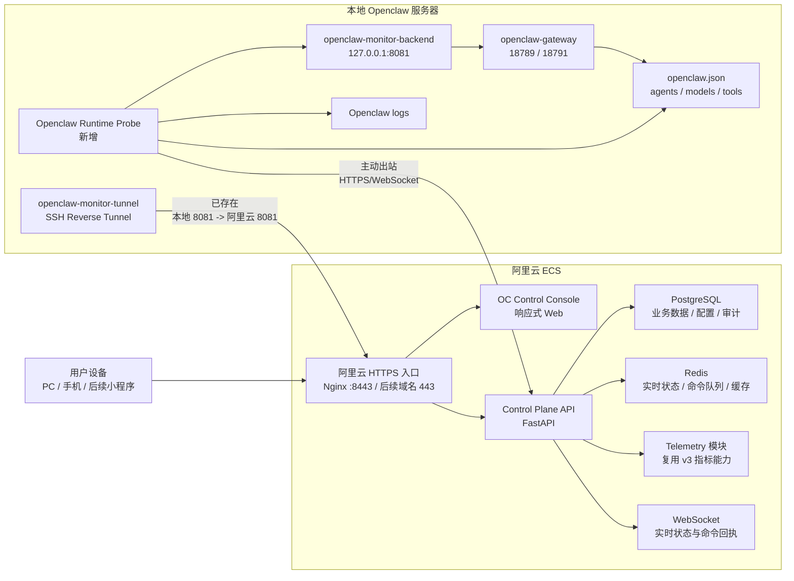

# Openclaw 管理与监控系统方案（基于当前 v3 现状优化版）

更新时间：2026-05-06

## 结论

当前 OC-Monitor v3 已经在阿里云侧跑起来了：API、PostgreSQL、Redis、Nginx HTTPS、collector 和 systemd 服务都存在，`https://47.98.184.188:8443/api/v1/metrics/health` 本机探测正常。但它仍然主要是“服务器指标监控原型”，还不是最初目标里的 Openclaw 管理与控制系统。

一期不建议继续堆功能式修补。更稳妥的路线是：保留 v3 已跑通的基础监控能力，把它收敛成可靠的 Telemetry 底座；在此之上新增 Openclaw Control Plane，专门负责 Agent、模型、任务、配置、审计和远程控制。

## 当前真实环境

### 阿里云控制端

- 主机：`47.98.184.188`
- 系统：Ubuntu 24.04.4 LTS
- 规格：2 核，约 1.6Gi 内存，40G 磁盘
- 已运行：
  - `oc-monitor-api.service`
  - `oc-monitor-collector.service`
  - `postgresql@16-main.service`
  - `redis-server.service`
  - `nginx.service`
  - 旧版 `oc-webmonitor.service`
  - 本地 Openclaw 反向隧道监听：`0.0.0.0:8081`
- 关键端口：
  - `8000`：OC-Monitor v3 API
  - `8443`：Nginx HTTPS 入口
  - `8500`：Nginx HTTP 跳转/入口
  - `8080`：旧 `oc_webmonitor`
  - `8081`：本地 Openclaw Monitor 反向映射
  - `5432`：PostgreSQL，仅本机
  - `6379`：Redis，仅本机
- 当前数据库表：
  - `server_metrics`
  - `agent_metrics`
  - `alerts`

### 本地 Openclaw 运行端

- 主机：`192.168.0.236`
- 系统：Ubuntu 24.04.4 LTS
- 规格：8 核，约 15Gi 内存，233G 根分区
- Openclaw 路径：
  - 主目录：`/home/samuel/.openclaw`
  - 配置：`/home/samuel/.openclaw/openclaw.json`
  - 日志：`/home/samuel/.openclaw/logs`
  - 工作区：`/home/samuel/.openclaw/workspace`
- 已运行：
  - `openclaw-gateway.service`
  - `openclaw-monitor-backend.service`
  - `openclaw-monitor-tunnel.service`
  - `clawpanel.service`
  - `nginx.service`
- 本地 Openclaw Monitor：
  - `127.0.0.1:8081`
  - 通过 SSH 反向隧道映射到阿里云 `0.0.0.0:8081`
- Openclaw 配置结构已确认存在：
  - 顶层包含 `agents`、`models`、`tools`、`channels`、`commands`、`secrets` 等字段
  - `agents` 下包含 `defaults`、`list`
  - `models` 下包含 `mode`、`providers`

### v3 项目研发状态

- 本地代码目录：`/home/samuel/.openclaw/workspace/dev_agent/oc-monitor-v3`
- GitHub 仓库：`https://github.com/Samueljackson6/OC-Monitor-v3`
- 本地分支：`master`
- 最新本地提交：`969cc87 feat: Phase 4 完成 - 部署上线`
- 当前工作区很脏：
  - 有大量已修改文件
  - 有删除文件
  - 有未跟踪文件
  - `ui/node_modules/`、`ui/dist/`、日志等产物混入工作区
- 这意味着后续接管前必须先冻结当前状态、建立干净分支和可重复部署流程。

## v3 的保留价值

可以保留：

- 阿里云上已经跑通的 FastAPI 服务。
- PostgreSQL 和 Redis 部署。
- Nginx HTTPS 入口。
- systemd 管理 API 与 collector。
- 基础服务器指标采集：CPU、内存、磁盘、Gateway 状态。
- 基础告警表和告警接口。
- 前端 Dashboard 的雏形。

不建议继续依赖的部分：

- 内置明文账号和硬编码 JWT Secret。
- 只面向单机服务器指标的数据库模型。
- 与 Openclaw 真实 Agent/模型/任务配置脱节的 `agent_metrics`。
- 以报告驱动、非验收驱动的“100% 完成”结论。
- 混乱的本地 Git 工作区和部署产物。
- 缺少迁移、审计、回滚、配置版本的控制面。

## 目标架构



核心原则：

- 本地 Openclaw 服务器仍不开放公网入口。
- 保留现有 SSH 反向隧道作为短期通道。
- 新增 Runtime Probe，由本地主动连接阿里云，长期替代临时隧道式控制。
- 云端只下发白名单命令，不直接暴露本地 shell 能力。
- 所有配置修改必须版本化、审计、可回滚。

## 功能边界

### 已有 v3 能力

- 阿里云服务器指标采集。
- 基础历史指标查询。
- 基础告警写入和查询。
- HTTPS 入口。
- PostgreSQL/Redis 基础设施。

### 必须新增的 Openclaw 能力

1. Openclaw 实例监控
   - Gateway 状态
   - Monitor backend 状态
   - Tunnel 状态
   - Openclaw 版本和配置摘要
   - 日志错误摘要

2. Agent 监控
   - 从 `openclaw.json` 读取真实 Agent 列表
   - 展示 Agent 名称、启用状态、默认模型、思考模式、最近活跃时间
   - 展示 Agent 进程、任务、异常和最近日志

3. Agent 配置管理
   - 模型供应商下拉选择
   - 模型下拉选择
   - 思考模式下拉选择
   - 启用/停用 Agent
   - 并发、超时、重试等参数
   - 配置预览、提交、应用、回执、回滚

4. 模型服务管理
   - 从 `models.providers` 读取供应商
   - 展示供应商、Base URL、模型列表、可用性
   - 单个供应商启用/停用
   - 单个模型启用/停用
   - Agent 可用模型范围

5. 任务统计
   - 任务总数、成功、失败、取消、运行中
   - 按 Agent、模型、任务类型、日期统计
   - 耗时、失败原因、调用成本或 Token 统计
   - 任务详情和执行链路

6. 安全与审计
   - 真实用户表，不再用内置 `fake_users_db`
   - 密码哈希
   - JWT Secret 从环境变量读取
   - 操作审计
   - 配置变更审计
   - 命令执行回执
   - 权限分级：只读、运维、管理员

## 数据模型优化

v3 当前只有 `server_metrics`、`agent_metrics`、`alerts`，不足以支撑管理系统。建议新增以下表：

```text
server
- id
- name
- role
- provider
- public_ip
- private_ip
- lan_ip
- os_json
- hardware_json
- last_seen_at

openclaw_instance
- id
- server_id
- name
- version
- status
- config_path
- workspace_path
- log_path
- local_api_base_url
- last_heartbeat_at

openclaw_agent
- id
- instance_id
- agent_key
- name
- enabled
- status
- current_task_id
- last_active_at
- raw_config_json

agent_config_version
- id
- agent_id
- provider_key
- model_key
- reasoning_mode
- concurrency_limit
- timeout_seconds
- retry_limit
- config_json
- version
- active
- created_by
- created_at
- applied_at
- apply_status

model_provider
- id
- instance_id
- provider_key
- name
- base_url
- enabled
- health_status
- last_checked_at
- raw_config_json

model_catalog
- id
- provider_id
- model_key
- display_name
- enabled
- supports_tools
- supports_reasoning_mode
- context_window
- raw_config_json

task_run
- id
- instance_id
- agent_id
- model_id
- task_type
- status
- started_at
- ended_at
- duration_ms
- error_code
- error_message
- trace_json

config_change
- id
- target_type
- target_id
- before_json
- after_json
- created_by
- created_at
- apply_status
- apply_message
- rollback_of

command_job
- id
- target_server_id
- command_type
- payload_json
- status
- requested_by
- requested_at
- accepted_at
- finished_at
- result_json
```

## API 优化

### 保留 v3 指标接口

- `GET /api/v1/metrics/realtime`
- `POST /api/v1/metrics/batch`
- `GET /api/v1/metrics/history`
- `GET /api/v1/alerts`

### 新增控制面接口

```text
GET  /api/v1/openclaw/instances
GET  /api/v1/openclaw/instances/{id}
POST /api/v1/openclaw/instances/{id}/refresh

GET  /api/v1/openclaw/agents
GET  /api/v1/openclaw/agents/{id}
PUT  /api/v1/openclaw/agents/{id}/config
POST /api/v1/openclaw/agents/{id}/config/apply
POST /api/v1/openclaw/agents/{id}/config/rollback

GET  /api/v1/openclaw/model-providers
PUT  /api/v1/openclaw/model-providers/{id}
GET  /api/v1/openclaw/models
PUT  /api/v1/openclaw/models/{id}

GET  /api/v1/openclaw/tasks
GET  /api/v1/openclaw/tasks/stats
GET  /api/v1/openclaw/tasks/{id}

GET  /api/v1/audit/config-changes
GET  /api/v1/audit/command-jobs
```

## 页面设计

### 1. 总览

- 阿里云控制端状态
- 本地 Openclaw 状态
- 隧道状态
- 在线 Agent 数
- 今日任务数
- 失败率
- 最近告警

### 2. 服务器

- 阿里云、本地 Openclaw、腾讯云韩国节点分组展示
- CPU、内存、磁盘、端口、服务、最近心跳
- 明确标记旧服务：`oc_webmonitor`、`openclaw-monitor-backend`、v3 API

### 3. Openclaw 实例

- Gateway、Monitor、Tunnel、ClawPanel 状态
- 配置文件路径、日志路径、证书路径
- 最近错误日志摘要

### 4. Agent

- Agent 列表
- 状态、模型、思考模式、是否启用
- 详情页展示任务、日志、配置版本
- 配置抽屉支持下拉修改模型和思考模式

### 5. 模型服务

- 供应商列表
- 模型列表
- 健康检查
- 启用/停用
- Agent 可用范围

### 6. 任务统计

- 趋势图
- 成功率/失败率
- Agent 维度
- 模型维度
- 任务类型维度
- 失败原因 TopN

### 7. 告警与审计

- 告警规则
- 告警历史
- 配置变更
- 命令执行记录
- 回滚入口

## 接管与重构路线

### M0：冻结与核验

- 给本地 `oc-monitor-v3` 建立接管快照。
- 清理 `.gitignore`：排除 `node_modules`、`dist`、日志、数据库、pid。
- 确认 GitHub 远端内容和本地 `origin/master` 是否一致。
- 把部署到阿里云 `/opt/oc-monitor` 的版本和本地仓库版本对齐。
- 补充部署状态说明，避免“文档 100%”和“实际缺口”继续混在一起。

### M1：安全基线

- 移除硬编码 JWT Secret。
- 移除内置明文账号。
- 用户表落 PostgreSQL。
- 密码使用 bcrypt/argon2。
- 所有写接口加认证和权限。
- 敏感配置进入环境变量或 secrets 文件。

### M2：监控底座稳定化

- 保留 v3 的服务器指标。
- 修复数据清理任务仍使用 SQLite 的问题，改为 PostgreSQL。
- Redis 连接从配置读取，不硬编码 `127.0.0.1`。
- 增加迁移机制，建议 Alembic。
- 增加健康检查：API、DB、Redis、collector、Nginx。

### M3：Openclaw Runtime Probe

- 本地新增轻量探针。
- 读取 `openclaw.json`，提取 Agent 和模型配置摘要。
- 读取 Openclaw 服务状态和日志摘要。
- 主动上报到阿里云 API。
- 短期继续复用现有 `8081` 反向隧道；长期用 HTTPS/WebSocket 出站连接。

### M4：Agent 与模型控制面

- 建立 Agent 配置表和版本表。
- UI 支持模型供应商、模型、思考模式下拉选择。
- 配置变更先写入云端版本。
- 本地探针领取配置应用命令。
- 应用前备份 `openclaw.json`。
- 应用后回传成功/失败。
- 支持一键回滚。

### M5：任务统计

- 接入 Openclaw 任务事件或日志解析。
- 建立 `task_run` 表。
- 先实现统计和详情查询，再做链路追踪。
- 逐步补充 Token/成本统计。

### M6：移动端与后续小程序兼容

- Web 先做响应式。
- API 按客户端类型设计鉴权。
- 避免页面强依赖桌面宽屏表格。
- 后续微信小程序只复用 API，不复用 Web 前端代码。

## 技术选型

继续使用：

- FastAPI
- PostgreSQL 16
- Redis
- Nginx
- systemd
- React + Vite

建议新增：

- Alembic：数据库迁移
- SQLAlchemy 2.0 异步模型规范化
- passlib/bcrypt 或 argon2：密码哈希
- Pydantic Settings：统一配置
- WebSocket：实时状态和命令回执
- pytest + Playwright：API 与页面验收

暂不建议：

- 现在就上 Kubernetes
- 现在就把全部功能塞进现有单文件 `App.tsx`
- 继续用报告式“完成度”替代真实验收

## 验收标准

### 平台可用性

- 阿里云重启后，API、Nginx、PostgreSQL、Redis、collector 自动恢复。
- 本地 Openclaw 重启后，Gateway、Monitor、Tunnel 自动恢复。
- 控制台能清楚显示两端状态。

### Openclaw 管理能力

- 能展示真实 Agent 列表。
- 能展示真实模型供应商和模型列表。
- 能修改 Agent 模型与思考模式。
- 配置变更能应用到本地 Openclaw。
- 配置变更有审计、有回执、可回滚。

### 任务统计能力

- 能看到任务数量、成功率、失败率。
- 能按 Agent 和模型筛选。
- 能查看失败原因。

### 安全能力

- 无硬编码生产密钥。
- 无明文内置管理员密码。
- 写操作必须登录。
- 配置和命令操作必须入审计。
- 本地只执行白名单命令。

## 当前优先级

1. 先接管并清理 v3 仓库和部署状态。
2. 修安全基线。
3. 让 v3 成为稳定 Telemetry 底座。
4. 新增 Openclaw Runtime Probe。
5. 做 Agent/模型配置控制面。
6. 做任务统计。

## 风险

- v3 当前代码和部署版本可能不完全一致，需要先做版本核验。
- 本地 v3 工作区混入产物，继续直接开发会增加误提交风险。
- 当前 API 部分能力没有真实权限保护，不能直接暴露到公网域名。
- 本地 `openclaw.json` 包含 `secrets`，探针必须只读取必要摘要，不能把密钥上报到云端。
- 现有 SSH 反向隧道可用，但不是长期控制面协议。
